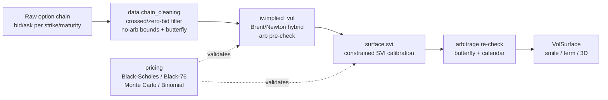

# volsurface — Options Pricing → Implied Volatility Surface Engine

**Project 1** of a three-system APAC derivatives toolkit. An institutional-style
Python package that takes a raw equity-index option chain and produces a clean,
arbitrage-free implied-volatility surface, with every numerical method validated
against analytical ground truth.

Built for APAC index options (KOSPI200, Nikkei 225, Hang Seng, ASX 200), which
are quoted off **futures** — so the engine works natively in Black-76 / forward
terms, not spot Black-Scholes.

---

## Why this exists

Black-Scholes assumes one constant volatility across all strikes and maturities.
Real markets violate this on every index — they exhibit a **skew** (out-of-the-
money puts trade richer than calls) and a **term structure**. The volatility
surface is the market's way of expressing exactly *how* it disagrees with the
constant-vol assumption. This engine reconstructs that surface from quotes and
enforces the no-arbitrage conditions a tradeable surface must satisfy.

---

## Architecture



### Module map

| Module | Responsibility | Curriculum stage |
|---|---|---|
| `pricing.black_scholes` | Closed-form BS/Black-76 + analytic Greeks | Stage 1 |
| `pricing.monte_carlo` | MC with antithetic + control variates | Stage 2 |
| `pricing.binomial` | CRR tree, American exercise, discrete divs, Richardson | Stage 2 |
| `iv.implied_vol` | Robust IV inversion (Brent primary, Newton polish) | Stage 3 |
| `data.chain_cleaning` | Quote validity + no-arbitrage filtering | Stage 4 |
| `surface.svi` | Constrained SVI calibration, arbitrage checks, surface | Stage 5 |
| `utils.synthetic_data` | Ground-truth chain generator for validation | — |
| `examples.run_pipeline` | End-to-end demo + plots | Stages 1–6 |

---

## Mathematical foundations (summary)

**GBM → Black-Scholes closed form** (risk-neutral valuation):
```
C = e^{-r τ} [ F Φ(d₁) − K Φ(d₂) ]          (Black-76, forward form)
d₁ = [ln(F/K) + ½σ²τ] / (σ√τ),   d₂ = d₁ − σ√τ
```
Spot BS is recovered by F = S·e^{(r−q)τ}; the package computes BS *through*
Black-76 so the two are consistent by construction.

**Implied volatility** is the inverse problem `C_BS(σ) = C_mkt`. Unique because
vega > 0, but numerically hard where vega → 0 (deep OTM / short-dated wings) —
hence Brent (bracketed, derivative-free) as the primary solver, not Newton.

**SVI total-variance slice** in log-moneyness `k = ln(K/F)`:
```
w(k) = a + b[ ρ(k−m) + √((k−m)² + s²) ],   w = σ_IV²·τ
```
Static no-arbitrage (butterfly) sufficient condition: `b(1+|ρ|) ≤ 4`, imposed as
a hard constraint in calibration. Calendar no-arbitrage (total variance
non-decreasing in τ) checked post-fit.

Full derivations are in the conversation transcript / `docs/` math notes.

---

## Validation (what the test suite proves)

All 30 tests pass. Highlights:

- **Closed form**: put-call parity holds to 1e-10; σ→0 and τ→0 limits correct;
  call delta ∈ (0,1); Black-76 ≡ BS via the forward.
- **Monte Carlo**: matches BS within standard-error bands; antithetic and
  control variates both demonstrably reduce variance; SE decays as O(n^{−1/2}).
- **Binomial**: converges to BS; American call (no div) ≡ European; American put
  premium ≥ 0; the CRR probability guard fires on invalid (low-σ/high-r) inputs;
  Richardson extrapolation is **parity-robust** (a real numerical subtlety — naive
  2V(2n)−V(n) is *worse* at odd n; see `binomial.py` docstring).
- **IV solver**: round-trips known σ to 1e-6 across strikes/maturities; rejects
  sub-intrinsic and above-bound prices with a reason; flags low-vega wing solves.
- **Cleaning**: removes injected crossed/zero-bid quotes; flags injected butterfly
  arbitrage; preserves >90% of a clean chain.
- **Surface**: recovers a known SVI slice to RMSE 1e-4; respects the butterfly
  constraint; fitted slices are butterfly- and calendar-arbitrage-free.
- **End-to-end**: fitted ATM IV recovers known ground truth to ~1e-6.

---

## Quickstart

```bash
pip install -e .
pytest -q                                   # 30 tests
python -m volsurface.examples.run_pipeline  # prints report, writes 3 plots
```

```python
from volsurface.pricing import black76_price, black_scholes_greeks
from volsurface.iv import implied_vol
from volsurface.surface import calibrate_svi_slice
import numpy as np

# price -> implied vol
price = float(black76_price(F=100, K=105, sigma=0.22, tau=0.5, r=0.04, option_type="call"))
res = implied_vol(price, F=100, K=105, tau=0.5, r=0.04, option_type="call")
print(res.iv, res.vega_at_solution)   # ~0.22, with vega diagnostic
```

---

## Known limitations (honest list)

- Single risk-free rate `r`, not a term-structure curve — fine for short-dated
  index options, increasingly wrong further out.
- Escrowed discrete-dividend model on the tree is an approximation (good, not
  exact) versus a full dividend-node shift.
- SVI is fit **per slice**; calendar arbitrage is *checked* but not *enforced* in
  the fit. Production upgrade is **SSVI** (joint fit, calendar-consistent by
  construction) — noted in `surface/svi.py`.
- Synthetic data only here; a live adapter (option chain + synced futures + rate
  curve) is the first real-data extension.

---

## Roadmap (Projects 2 & 3)

This package is Project 1. Projects 2 (multi-asset statistical arbitrage) and 3
(volatility forecasting → vol-targeting) share infrastructure with it — notably a
walk-forward / out-of-sample evaluation harness and an event-tagging calendar —
and will be added as sibling packages.
